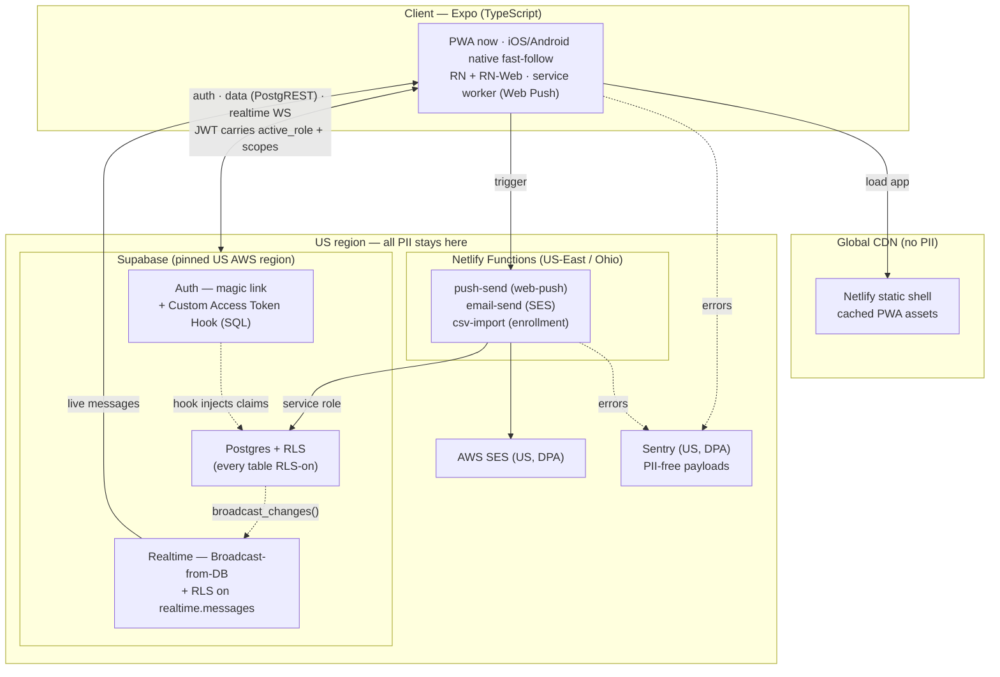
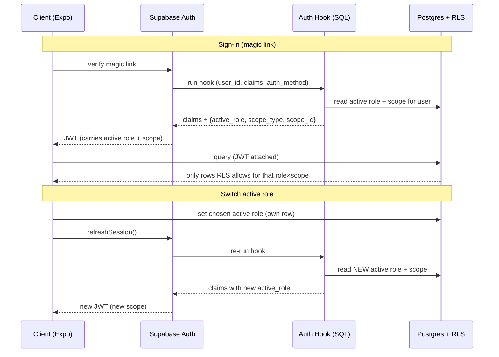
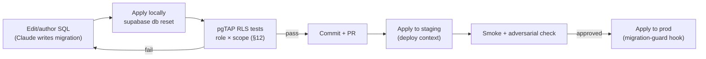
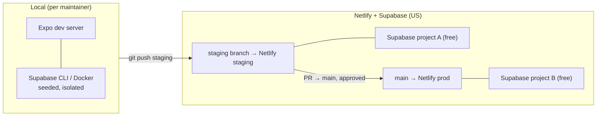
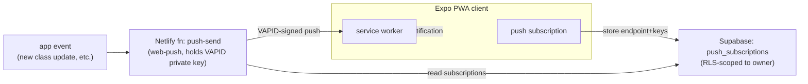
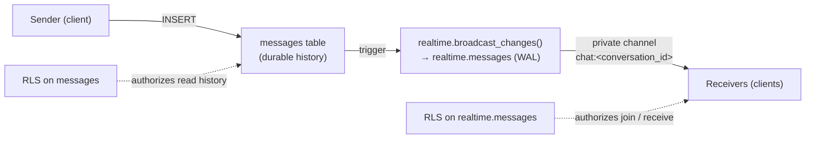
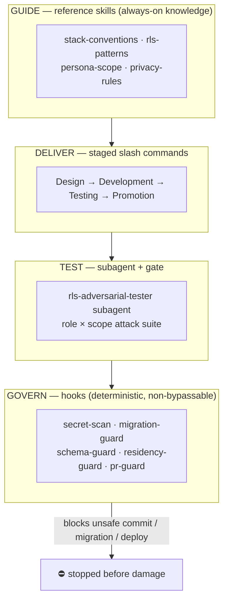
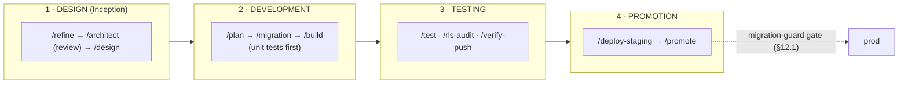
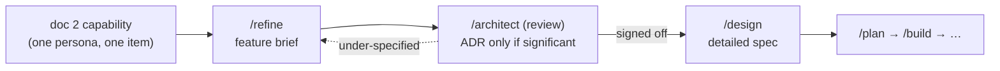

# 3 — Architecture

**Date:** 2026-06-16
**Status:** Authoritative for *how* the system is built. Downstream of, and bound by, **[1_GREENFIELD_POC_PROPOSAL.md](1_GREENFIELD_POC_PROPOSAL.md)** (the *what/why*) and **[2_POC_FEATURE_SCOPE.md](2_POC_FEATURE_SCOPE.md)** (per-persona scope).

---

## 1. Purpose & relationship to docs 1–2

This document is the technical architecture of record for the CMDFW Bala Vihar pilot. It is downstream of, and bound by, two authoritative documents:

- **[1_GREENFIELD_POC_PROPOSAL.md](1_GREENFIELD_POC_PROPOSAL.md)** — owns the *what* and *why*: goals, locked assumptions, constraints, the stack decision, the cost model, and the data-model additions.
- **[2_POC_FEATURE_SCOPE.md](2_POC_FEATURE_SCOPE.md)** — owns per-persona feature scope and the thinnest end-to-end slice.

This doc does **not** re-decide the stack — it specifies the *runtime topology, repository structure, environments, data/identity/realtime mechanics, security architecture, and the Claude Code delivery system* that turn those decisions into something three non-technical maintainers can build and operate with Claude Code.

**Authority & precedence.** The earlier root-level drafts (`01`–`08`, `10`, `11`, `ARCHITECTURE_DECISIONS.md`) — the vibe-coded docs doc 1 §2 says to challenge, not adopt — have been **removed from the tree** (preserved in git history). Should any of their content resurface, **this document and docs 1–2 supersede it.** One conflict *between the authoritative docs* is resolved here by decision: **real-time chat is POC-core** (per doc 2 §2/§4); doc 1's Appendix A, which framed chat as post-POC, has been updated to match.

**Validation.** Every load-bearing stack fact was re-verified live on 2026-06-16/17 (Expo SDK 56 / RN 0.85 / RN-Web 0.21; Supabase Custom Access Token Hook; Realtime Authorization via RLS on `realtime.messages`; Broadcast-from-DB; Supabase Free = 2 active projects/org). Citations are inline in the relevant sections.

---

## 2. Architecture at a glance

A single Expo codebase talks **directly** to Supabase for all data, auth, and realtime — access enforced in the database by RLS, not in app code. A small set of US-region serverless functions handle the three jobs that need a trusted server (push-send, email-send, CSV import). Everything that touches PII lives in a US region; only the static PWA shell rides a global CDN.



**Reading the diagram:**
- **Direct client↔Supabase** is the default path. The JWT — stamped with `active_role` + scope claims by the auth hook — is what every RLS policy reads. App code cannot widen access beyond what the database allows.
- **Functions exist only for trusted-server work**: sending push (holds VAPID keys), sending email (holds SES creds), and CSV import (bulk writes with the service role). They are the *only* holders of privileged secrets.
- **Realtime is DB-driven**: a Postgres trigger calls `realtime.broadcast_changes()`; clients receive on private channels authorized by RLS on `realtime.messages`.
- **Trust boundary**: the `us` box is the compliance perimeter — Supabase, Functions, SES, Sentry all US-region under DPA. The global CDN serves only the cacheable, PII-free shell.

---

## 3. Runtime topology & data residency

Data residency is a hard constraint (doc 1 §3): every component that can see PII runs in a **US region**, under a signed DPA, with no marketing/ad trackers anywhere. This table is the authoritative residency map — it's what the "verify before launch" checklist (§13) audits against.

| Component | Runs where | Holds / sees | Residency mechanism | PII? |
|---|---|---|---|---|
| **Expo client** | End-user device | Session JWT, rendered data | N/A (user's device) | In transit |
| **Static PWA shell** | Netlify global CDN | App bundle, icons, SW | Cacheable, **no PII by design** | No |
| **Supabase** (Postgres/RLS, Auth, Realtime, Storage) | **Pinned US AWS region** (fixed at project creation) | All app data, auth, chat, consent, audit | Region pinned per project; DPA signed | **Yes — primary store** |
| **Netlify Functions** | **US-East / Ohio** (configured) | Transient payloads, privileged secrets | Function region set explicitly | In transit |
| **AWS SES** | **US region** | Recipient email + message body | US region endpoint; DPA | **Yes — email** |
| **Sentry** | **US data region** | Stack traces, breadcrumbs | US org region; DPA; **PII scrubbed** | Minimized |
| **Apple APNs / Google FCM** | Vendor (native, post-POC) | Device push tokens | N/A at POC (Web Push only) | Deferred |

**Topology rules that follow from the table:**

1. **One compliance perimeter.** The US box in §2 is the boundary. Nothing PII-bearing may be added outside it without a residency review. New third-party calls are processors-only, US-resident, under DPA — never marketing/analytics trackers.
2. **The CDN is deliberately dumb.** The Netlify shell is static and PII-free; all dynamic, identity-scoped data is fetched client→Supabase at runtime. This is also what keeps Netlify credit usage low (doc 1 §8) — the CDN serves cached bytes, not data traffic.
3. **Secrets live only in functions and CI.** VAPID private key, SES credentials, and the Supabase **service-role** key never reach the client bundle. They exist as environment variables on Netlify Functions (per-context) and in CI — never in `app/` code, never in Git. (Enforced by a governance hook — §12.)
4. **Region is set once, verified always.** Supabase region is fixed at project creation and cannot be moved later; both cloud projects (staging, prod — §7) must be created in the same US region. SES and Sentry regions are configured at setup. §13 carries the verification obligations.

**Residency citations (verified 2026-06-16):** Supabase region pinning — exact US AWS region selectable, fixed at creation; SES US-region endpoint + DPA; Sentry US data region + DPA (doc 1 §3 relaxation). No PII egress to non-US services.

---

## 4. Repository & project structure

One Git repository, one language family (TypeScript + SQL), predictable paths. This is a deliberate optimization for the maintainer reality (doc 1 G3): Claude Code reasons best when the whole system is in one tree, and three non-technical maintainers benefit from a single mental model.

```
cmdfw-balavihar/
├── app/                      # Expo Router screens & routes (one tree → web + native)
│   ├── (auth)/               #   magic-link sign-in, role selection
│   ├── (tabs)/               #   feed, classes, attendance, chat, dashboards
│   └── _layout.tsx
├── components/               # shared presentational UI (persona-agnostic)
├── features/                 # per-domain logic, grouped by owner persona (§12.12)
├── lib/
│   ├── supabase.ts           # typed client (anon key only — never service role)
│   ├── auth/                 # session + active-role switching
│   ├── push/                 # service-worker registration, subscribe
│   └── theme.ts              # GENERATED from design/sankalp/design-tokens.json (Unistyles) — added at app scaffold
├── netlify/
│   └── functions/            # US-region trusted-server jobs (TS)
│       ├── push-send.ts      #   web-push (holds VAPID private key)
│       ├── email-send.ts     #   AWS SES
│       └── csv-import.ts     #   enrollment import (service role)
├── supabase/
│   ├── migrations/           # timestamped SQL — schema + RLS + auth hook (source of truth)
│   ├── seed/                 # synthetic POC data (no real minors' data)
│   └── tests/                # pgTAP RLS adversarial tests (role × scope)
├── .docs/                    # 1_PROPOSAL, 2_FEATURE_SCOPE, 3_ARCHITECTURE
│   ├── adr/                  #   architecture decision records (decision log)
│   └── specs/<persona>/      #   persona → functionality specs (§12.12)
├── .claude/
│   ├── CLAUDE.md             # context layer (§12.9)
│   ├── settings.json         # enforcing hooks (§12.1)
│   ├── rules/                # path-scoped rules (paths: globs)
│   ├── skills/               # govern · guide · deliver · test (§12)
│   └── agents/               # subagents (e.g. RLS adversarial tester)
├── design/                   # design system exported from Open Design (added after team refinement — ADR-0010)
│   └── sankalp/              #   DESIGN.md · USAGE.md · design-tokens.json · components · prototypes/
├── public/                   # service worker, PWA manifest, icons (static, PII-free)
├── netlify.toml              # deploy contexts (prod/staging/dev) + function region = us-east
├── app.json / eas.json       # Expo + EAS build config (native fast-follow)
└── package.json
```

**Conventions that make this AI-legible and safe:**

1. **The boundary is the directory.** `app/` + `components/` + `features/` + `lib/` is client code and may hold only the **anon** Supabase key. `netlify/functions/` is the only place privileged secrets live. `supabase/` is the database's source of truth.
2. **`features/` keeps units small and bounded** (grouped by owner persona — §12.12). Each domain folder owns its data hooks, components, and types — understandable and testable in isolation.
3. **The database is code.** `supabase/migrations/` is authoritative (§6); no schema change exists unless it's a committed SQL migration. RLS policies and the auth hook live here too — security is reviewable in diffs.
4. **Governance is in the repo.** `.claude/` ships *with* the code, so the skills, subagents, and blocking hooks (§12) apply to every maintainer on every clone — governance isn't a per-person setup step.
5. **One install, one run.** A single `package.json` at root; `npm run` scripts wrap the Expo, Supabase-CLI, and Netlify commands so maintainers invoke intent ("start", "test", "deploy-staging"), not raw tooling.

---

## 5. Identity, multi-role & access control

This is the architecture's center of gravity. Doc 1 §2/§4 make multi-persona resolution a *hard* requirement: one account may hold several roles spanning **Parent → Teacher → Coordinator (session) → BV Coordinator**, each with a different access *scope* (own children → own class → own session → org-wide), with an active-role switch. The design enforces this in the **database**, not in app code.

### 5.1 Identity

- **Magic link (passwordless)** is the primary login (doc 1 §6). No passwords to manage for non-technical users.
- **Accounts are provisioned** by a coordinator/admin via CSV import (COPPA — doc 1 §2). **No minor self-registration**, ever.
- Supabase Auth issues a JWT on sign-in and on refresh. That JWT is the single source of truth for *who you are* and *what role you're currently acting as*.

### 5.2 The claims chain: auth hook → JWT → RLS

1. **`user_roles` table** — `(user_id, role, scope_type ∈ {org,center,session,class}, scope_id)`. Many rows per user — one per role-grant. The catalog of everything a user *may* act as.
2. **Custom Access Token Hook** (a **Postgres function**, SQL — no Deno). Runs *before every token is issued or refreshed*, reads the user's chosen active role, and stamps custom claims into the JWT: `active_role`, `scope_type`, `scope_id`. *(Verified 2026-06-16: the hook receives `user_id`/`claims`/`authentication_method` and returns the augmented claims; Supabase validates them against its claim spec.)*
3. **RLS policies** on every table read those claims via `auth.jwt()`. A policy grants a row only if the active role *and* its scope match.



### 5.3 Active-role switching

Switching roles = **re-issuing the token**. The client writes the desired active role to its own (RLS-protected) row, calls `refreshSession()`, and the hook re-stamps the JWT with the new `active_role`/scope. Because every RLS policy reads the *current* JWT, access changes atomically the moment the new token lands — there is no app-side "if role then show" that could leak. The UI's active-role switcher is cosmetic; the JWT is the enforcement.

Navigation is **role-derived** and roles are **distinct modes** — switching swaps the whole app (ADR-0014). The switcher is shown **only when an account holds ≥2 roles**; a single-role user sees a **static context chip** (Center · Session · Grade/Class) instead.

### 5.4 Scope model

| Role | `scope_type` | Sees |
|---|---|---|
| Parent | (per child) | Own children's records only |
| Student | self | Own class info, own attendance, own comments/chat |
| Teacher | class | Own class roster, attendance, updates, comment moderation |
| Coordinator (session) | session | All classes in own session/center; approvals in own session |
| BV Coordinator (org) | org | Org-wide rollups (degenerate single-session at pilot) |
| Admin | org | Full org; user/role management |
| **System** | engine | Cross-cutting (auth/RLS engine, consent/audit/retention, infra) — §12.12 |

### 5.5 Hardening the hook (verified security model)

Per the Supabase docs (verified 2026-06-16), the hook function must: **`grant execute` to `supabase_auth_admin`** and **revoke from `anon`, `authenticated`, `public`**; and any RLS-protected table the hook reads (i.e. `user_roles`) must carry a policy permitting `supabase_auth_admin`. This keeps the role-claiming logic unreachable from the data API — a client cannot invoke the hook or forge claims.

> **Standing obligation:** §11 and §12 require **adversarial RLS tests per role × scope** proving no cross-scope leakage — especially of minors' data. Enforced as a merge gate by the test pillar (§12), not left to discipline.

---

## 6. Data layer & migrations

The database is the system of record for everything except enrollment (doc 1 §3 — the member system stays SoR for enrollment; the app syncs via a CSV import seam). Because access control for minors lives *in* the database (§5), the schema itself is a security artifact — reproducible, reviewable, identical across environments.

### 6.1 Source of truth

All schema, RLS policies, and the auth hook live as **timestamped SQL migrations in `supabase/migrations/`**, applied with the Supabase CLI. Rules:

- **No change exists unless it's a committed migration.** No clicking in Studio to alter prod (blocked by a governance hook — §12). Studio is for *reading* and for drafting SQL that then becomes a migration.
- **Every environment rebuilds from the same files.** Local (`supabase start`), staging, and prod (§7) all apply the same ordered migrations.
- **RLS and the auth hook are migrations too.** Security is diffable.

### 6.2 The data model this architecture must carry

The canonical relational core — `centers → sessions → classes → enrollments → attendance → students → families` — is to be finalized in the schema-design pass (doc 2 §6 open item). On top of it, doc 1 §10 mandates these constraint-driven additions, all **RLS-on**:

| Table | Purpose | Access posture |
|---|---|---|
| `user_roles` | Many scoped roles per user (§5) | Read by auth hook (as `supabase_auth_admin`); not client-writable |
| `consents` | Parental + media consent, timestamped, revocable | Scoped to subject's family/org |
| `audit_log` | Every access to a minor's record (actor, action, target, at) | Append-only; admin/coordinator read-scoped |
| `push_subscriptions` | Web Push endpoints/keys per user | RLS-scoped to owning user; payloads PII-free |
| `conversations`, `conversation_participants`, `messages` | Chat durable history (POC-core — §9) | Private; RLS mirrors channel access |
| Retention fields + scheduled deletion job | Retention/deletion policy enforcement | Org-policy driven (doc 1 §11, legal sign-off) |

> - `conversation_participants` carries the member's **role** and a membership **derived from the class's grade band** (ADR-0015); add **`notify_level`** (`all | mentions | muted`) + a per-user `notification_default` (ADR-0016).
> - **mentions** (`@Parents` / `@Students` / `@individual`) stored/parsed on `messages`; the `push-send` function (§8.1) evaluates `notify_level` + mention targeting before dispatch, payloads PII-free.

> Schema design is a downstream task. §6 fixes *how* the schema is owned and evolved; the column-level model is the next deliverable (doc 2 §6 item 1), produced as migrations under this regime.

### 6.3 Migration workflow



The **migration-guard hook** (§12) blocks a prod migration unless the RLS test suite has passed.

### 6.4 Seed data

`supabase/seed/` holds **synthetic** POC data generated from scratch (doc 2 §6 item 2). **No real minors' data, ever, in any non-prod environment.** Seed runs automatically on local `db reset`.

---

## 7. Environments & deployment

Three environments, **two free-tier cloud Supabase projects**, zero dollars at pilot (Supabase Free = 2 active projects/org, verified 2026-06-16). Isolation where it matters — destructive RLS tests and schema changes never touch prod or real data.

### 7.1 Environment → infrastructure map

| Env | Client / host | Database | Purpose |
|---|---|---|---|
| **local** | `npm run start` (Expo dev server) | **Supabase CLI (Docker)** — throwaway, seeded | Day-to-day dev; destructive RLS tests; instant `db reset` |
| **staging** | Netlify `staging` deploy context (branch) | **Cloud project A (free)** | Integration, smoke, on-device PWA push verification |
| **prod** | Netlify `prod` context (`main`) | **Cloud project B (free)** | The pilot — real users, real (minimal) minors' data |



### 7.2 Deployment model

- **One Netlify project, three deploy contexts** (doc 1 §8) — a shared credit pool, so no cross-project pause. Branch `main` → prod; branch `staging` → staging; deploy previews → ephemeral.
- **Per-context environment variables.** Each context carries its *own* Supabase URL + **anon** key (distinct creds per env). The **service-role** key, VAPID private key, and SES creds are set only on **Functions** env (per context), never in the client build.
- **Functions pinned to US-East / Ohio** in `netlify.toml` — keeps the trusted-server tier inside the compliance perimeter (§3).
- **Promotion is a PR to `main`.** Staging is validated, then merged; the **migration-guard hook** (§12) ensures prod DB migrations only apply after RLS tests pass.

### 7.3 Native fast-follow

Native (iOS/Android) is built from the *same* repo via **EAS** (`eas build`) — not a rewrite (doc 1 §6). It reuses the same Supabase projects and env model; only the push transport changes (Web Push → Expo Push/APNs/FCM, post-POC). Native builds point at staging/prod by build profile in `eas.json`.

### 7.4 Operational guardrail: the Netlify pause cliff

Netlify Free = 300 credits/mo; at exhaustion the site is **paused — a full outage** (doc 1 §8, verified). Mitigations: static-shell-only hosting (data rides Supabase, uncounted); single project + deploy contexts (shared pool, no surprise per-project pause); usage alerts at 50/75/100%; **Netlify Personal ($9/mo, 1,000 credits)** pre-planned as insurance for rollout.

### 7.5 Future: org-owned AWS deployment

The POC deploys on the managed stack above. A **whole-stack alternative** — CMDFW running the web app **and** a self-hosted Supabase backend on its own **AWS EC2** (US region) — is documented separately in **[AWS_HOSTING_PATH.md](AWS_HOSTING_PATH.md)**. It trades volunteer-friendly ops and $0 cost (doc 1 G3/G4) for full org data ownership, and is a deliberate *future* decision — not part of the pilot. Because the app code and SQL migrations are identical, adopting it is a deployment change, not a rewrite.

---

## 8. Notifications

Two channels at POC: **Web Push** (in-app/PWA) and **transactional email** (SES). Both are POC-core — the thinnest slice (doc 1 §9, doc 2 §5) requires a PWA push delivered to an installed home-screen PWA. Native push (APNs/FCM) is an explicit non-goal at POC.

### 8.1 Web Push (PWA)



- **Subscription:** the client registers a **service worker** and subscribes with the **VAPID public key**; the resulting endpoint + keys are written to the RLS-scoped `push_subscriptions` table. Payloads are kept **PII-free** ("New update in your class" — no names).
- **Sending:** the **`push-send` Netlify function** (US-East/Ohio) holds the **VAPID private key**, reads the relevant subscriptions, and dispatches `web-push` notifications. Only secret-holder for push (§3).
- **iOS hard caveat (verified, doc 1 §9):** Web Push on iOS works **only for a PWA added to the Home Screen, iOS 16.4+** — not in a plain Safari tab. The POC must include an **"Add to Home Screen" onboarding step**; on-device verification on a real iPhone is the **highest-risk POC item** (§13).
- Dispatch respects each recipient's per-channel **`notify_level`** and `@mention` targeting (ADR-0016); high-reach roles default to *Mentions only*.

### 8.2 Email (SES)

- The **`email-send` Netlify function** sends transactional email via **AWS SES (US region, DPA)** — magic-link auth emails and notification fallbacks.
- **Magic link is auth-critical** (primary login — §5). At rollout, deliverability must be verified (DKIM/SPF) and Supabase Auth send-rate limits checked (doc 1 §11). Comfortable at pilot volume.
- **Setup is effort, not cost** (doc 1 §8): domain verification + DKIM/SPF + bounce/complaint handling + a one-time SES sandbox-exit request.

### 8.3 Native fast-follow

Native builds (post-POC) switch the push transport to **Expo Push → APNs/FCM** using the same `push_subscriptions` seam and `push-send` pattern — no architectural change elsewhere.

---

## 9. Realtime / chat architecture

Chat is POC-core. Membership keys off **grade** (ADR-0015): KG–Gr 8 class chat = **teacher ↔ parents**; HS (Gr 9+) class chat = **teacher + students + parents** (with `@mentions`). Plus **session staff** (coordinator + teachers) + 1:1 coordinator↔teacher, and an org **leadership** group. **No open student↔student DMs.** It rides the existing Supabase stack — zero new vendors, US-resident, DB-enforced, auditable. The governance gate is a hard precondition before it ships (§9.4).

### 9.1 Mechanism (verified 2026-06-17)



- **Durable history** lives in your own `messages` / `conversations` / `conversation_participants` tables (Broadcast doesn't persist). `realtime.messages` is WAL-backed, daily-partitioned, **3-day** retention (verified) — transport, not record.
- **Live delivery** is **Broadcast triggered from the database**: a Postgres trigger calls `realtime.broadcast_changes()` on message insert, emitting to a private channel `chat:<conversation_id>`.
- **Critical rule (verified):** use **Broadcast, not Postgres Changes** — Postgres Changes does one read per subscribed user per change (DB bottleneck); Supabase recommends re-streaming via Broadcast at scale.

### 9.2 Access control (the differentiator)

Channel access is governed by **RLS on `realtime.messages`** with **private channels** (`private: true`, "Allow public access" disabled — verified 2026-06-17). Each policy maps to an action: who may **broadcast to**, **receive from**, or **publish presence**. Permissions are computed from the user's JWT (the `active_role`/scope claims, §5) at WebSocket connect.

- **1:1 & group:** participants of a `conversation` may join/receive on its channel; non-participants cannot.
- **Participant ladder (ADR-0015):** Coordinator is a **participant** (read + write) in any class chat **in their session**; BV Coordinator / Admin are participants in **any thread org-wide**. RLS grants write per role × scope (not SELECT-only), still scope-bound and paired with `audit_log`. DB-enforced participation + oversight a third-party chat SDK couldn't give without breaking US-residency/no-marketing-sharing.
- **Realtime Authorization is required + enabled by default** for DB-triggered broadcast (verified) — chat cannot bypass the policy layer.

### 9.3 Capacity (verified, doc 1 §8)

Free: **200 concurrent / 100 msg-sec / 100 channel-joins-sec / 256 KB payload.** Pro: **500 / 500 / 500 / 3 MB**, per-project configurable. **Pilot (50–150) fits Free; rollout (~800) fits Pro.** Chat is the main realtime cost driver at rollout — it rides Supabase, not Netlify.

### 9.4 Governance gate (hard precondition — HS students are minors)

Before student chat goes live (doc 2 §2, doc 1 App. A, §3/§10), the org must define:
1. **Who-may-chat-whom** — **resolved** by ADR-0015 (grade-band class chats; participant ladder; **no open student DMs**). Notification noise → ADR-0016. **Moderation/report + retention → deferred post-pilot** under interim safeguards (ADR-0017); revisit before go-live.
2. **Moderation / report** mechanism.
3. **Message retention** policy.

These are policy decisions, not code, and they bound the RLS policies above. The newer **Realtime Authorization model** must also be confirmed GA and pass adversarial channel-access tests per role × scope (§5, §11, §12) — especially for minors.

---

## 10. Observability, cost & operational guardrails

### 10.1 Error monitoring

**Sentry, US data region, under DPA** (doc 1 §3 relaxation). Both the client and the Netlify functions report to it. **PII is scrubbed** from error payloads — never names, emails, or message bodies. Zero ops burden. (GlitchTip self-host remains a documented fallback, not the default.)

### 10.2 Cost model (carried from doc 1 §8, verified 2026-06-16)

| Stage | Users | Supabase | Web host | Email | Monitoring | **Total/mo** |
|---|---|---|---|---|---|---|
| **Pilot (POC)** | 50–150, 1 center | Free (US) | Netlify Free | SES (pennies) | Sentry Free (US) | **~$0** |
| **Rollout** | ~800 multi-center | Pro $25 | Netlify Free→Personal $9 | SES ~$1 | Sentry Free→Team if needed | **~$25–45** |

One-time/annual (native, post-POC): Apple $99/yr (501(c)(3) waiver) · Google Play $25 once.

### 10.3 Named cliffs (rollout only — none bind at pilot)

- **Supabase Free → Pro:** 500 MB DB or 7-day inactivity pause; 2 active projects/org (verified — drives the env model, §7).
- **Realtime 500 concurrent / 500 msg-sec on Pro** — chat is the main driver (§9), configurable beyond Pro.
- **Netlify credits 300 free → Personal $9 (1k) / Pro $20 (3k).**
- **EAS OTA** free ≤1K MAU (native, post-POC).

### 10.4 Operational guardrails

- **Netlify pause = full outage** (doc 1 §8). Mitigations in §7.4.
- **Supabase inactivity pause** (Free, 7-day): prod sees regular pilot traffic, so won't trigger in prod; relevant only for idle environments.
- **In-app/Postgres metrics** for product analytics — **no ad/marketing trackers** (doc 1 §3). Any future product-analytics tool must be US-resident, under DPA, no marketing use.

---

## 11. Security & compliance architecture

The whole stack was chosen to make children's-data safety a **database-enforced** property, not an app-code promise (doc 1 §3/§6).

### 11.1 Defense in depth

| Layer | Control |
|---|---|
| **Identity** | Provisioned accounts only; **no minor self-registration** (COPPA); magic-link auth (§5) |
| **Authorization** | **RLS on every table**, keyed to `active_role` + scope claims (§5). App code cannot widen access |
| **Data minimization** | Minimal columns on minors' records; PII-free push payloads; PII scrubbed from Sentry |
| **Residency** | All PII-touching services US-region, under DPA (§3) |
| **Auditability** | `audit_log` on every access to a minor's record |
| **Secrets** | Service-role / VAPID / SES keys only in functions + CI, never in client or Git (§3) — enforced by hook (§12) |

### 11.2 Consent, audit & retention

- **`consents`** — parental + media consent, timestamped, revocable (doc 1 §10). Captured at onboarding; enforced before media/feature exposure.
- **`audit_log`** — append-only; actor, action, target, timestamp. Read-scoped to admin/coordinator. Pairs with chat oversight (§9.2).
- **Retention/deletion** — retention fields + a **scheduled deletion job** (doc 1 §10). The policy needs **org + legal sign-off** before finalizing (doc 1 §11) — a precondition (§13).

### 11.3 The standing test obligation

> **Adversarial RLS tests per role × scope** must prove the Parent→Teacher→Coordinator→BV Coordinator span (§5) cannot leak across scopes — especially minors' data — including after an active-role switch.

**Enforced as a merge/deploy gate** by the test pillar (§12) via pgTAP suites in `supabase/tests/` and the RLS-tester subagent — not left to reviewer diligence. The migration-guard hook (§6.3, §12) blocks prod migrations unless these pass.

### 11.4 Chat-specific safety

Student chat inherits all of the above **plus** the §9.4 governance gate. The newer Realtime Authorization model must be confirmed GA and adversarially tested for minors before chat ships.

---

## 12. The Claude Code delivery system (govern · guide · deliver · test)

### 12.0 Overview — the four pillars

The maintainer reality is **three non-technical volunteers + Claude Code** (doc 1 G3). That makes the delivery *system itself* part of the architecture: the repo ships a governance layer in `.claude/` (§4) so the same rails apply to every maintainer on every clone. It uses four Claude Code primitives — **skills** (reference + task), **subagents**, and **hooks** — mapped to four pillars. Governance is **skills + enforcing hooks**: guidance Claude follows, *plus* deterministic gates that block dangerous paths regardless of what Claude or a human intends.



### 12.1 GOVERN — hooks (safety rails that don't depend on memory)

Deterministic `PreToolUse` / `UserPromptExpansion` hooks in `.claude/settings.json`. They **block**, not advise — the right tool for non-technical owners of minors' data, because they hold even if Claude forgets a rule or a human rushes.

| Hook | Fires on | Blocks |
|---|---|---|
| **secret-scan** | Write/Edit, pre-commit | Service-role / VAPID / SES keys, `.env`, or PII in client code or Git (§3) |
| **migration-guard** | prod migration / `/promote` | Any prod DB change unless the RLS test suite passed (§6.3, §11.3) |
| **schema-guard** | edits to consent/audit/RLS/auth-hook migrations | Silent changes to security-critical SQL — forces explicit review |
| **residency-guard** | new external endpoints/deps | Non-US processors or marketing/analytics trackers (§3) |
| **pr-guard** | `gh pr create` (any stage, incl. `/promote`) | Opening a PR unless `/test` passed for exactly this source tree (§12.1, §12.3) — TDD non-negotiable |

### 12.2 GUIDE — reference skills (knowledge Claude applies inline)

| Skill | Teaches |
|---|---|
| **stack-conventions** | Repo layout (§4); anon-vs-service-role key rules; TS/SQL idioms; npm-script intents |
| **rls-patterns** | RLS keyed to `active_role`/scope (§5); the auth-hook pattern + hardening; leakage pitfalls |
| **persona-scope** | The role × scope model (§5.4) — what each persona may see |
| **privacy-rules** | PII-free payloads, data minimization, consent/audit/retention obligations (§11) |

### 12.3 DELIVER — staged slash-command pipeline

Delivery runs in four stages — **Design → Development → Testing → Promotion** — each invoked by stage-scoped slash commands, each backed by publicly-supported skills (official-first, §12.7). Stages 1–3 run **in parallel per Unit of Work**; Promotion is the convergence point.



| Stage | Slash commands | Backed by (official → open-source) |
|---|---|---|
| **1 · Design** | `/refine <persona> "<item>"` → `/architect` (review) → `/design` → spec in `.docs/specs/<persona>/` | **superpowers:brainstorming** + **writing-plans**; GUIDE skills (§12.2) |
| **2 · Development** | `/plan` · `/migration` (schema+RLS+pgTAP stub) · `/build` (TDD, unit tests first) | **Supabase AI Prompts** (Create migration / RLS / Declarative schema / Edge Functions / SQL style) + **`supabase/mcp`**; **superpowers:test-driven-development**; Expo/EAS CLI |
| **3 · Testing** | `/test` (pgTAP RLS + app units) · `/rls-audit` (adversarial subagent, §12.4) · `/verify-push` (iOS home-screen push) | Supabase RLS prompts; **superpowers:systematic-debugging**; **playwright-cli** (+ `callstack/agent-device` for native later) |
| **4 · Promotion** | `/deploy-staging` · `/promote` (PR→main→prod) | Netlify deploy contexts (§7) + Supabase CLI; **gated by GOVERN hooks** (§12.1) |

### 12.4 TEST — subagent + enforcement

The **`rls-adversarial-tester` subagent** (`.claude/agents/`) runs in its own context with a narrow toolset (Read/Grep/Bash). Its single job: generate and run **role × scope attack tests** that try to leak data across scopes — especially minors' — including after an active-role switch (§5, §11.3). It reports leaks; the **migration-guard hook** turns its pass/fail into a hard prod gate.

### 12.5 Why this shape

- **Hooks for governance** because safety for minors' data must be *non-bypassable*.
- **Reference skills for guidance** because the architecture's rules should be applied on *every* turn, inline.
- **Task skills for delivery** because non-technical maintainers need intent-level verbs, repeatable and tool-scoped.
- **A subagent for testing** because adversarial RLS probing is a distinct, isolated reasoning job whose result *gates* delivery.

### 12.6 Parallel delivery model

The architecture decomposes into **independent Units of Work** — *(owner persona, functionality)* pairs (§12.12), realized as `features/` units. Each flows through Design → Development → Testing **on its own branch/worktree** (`superpowers:using-git-worktrees`), so the three maintainers + Claude deliver several in parallel.

- **Parallel:** feature units (isolated folders, isolated tests).
- **Serialized seam:** the **database schema** — migrations are applied in order; `/migration` + the schema-guard hook keep concurrent schema work safe.
- **Convergence:** **Promotion** is the single funnel — all units merge to `main`, where the migration-guard hook blocks prod unless RLS tests pass.

### 12.7 Skills sourcing policy

When adding a skill/command/hook, source in this order: **(1)** official stack sources — Anthropic skill format (`anthropics/skills`), the official plugin marketplace (`anthropics/claude-plugins-official`), Supabase AI Prompts + `supabase/mcp`, Expo/EAS CLI; **(2)** highest-starred, actively-maintained open-source (`obra/superpowers`, `wshobson/agents`, via the `hesreallyhim/awesome-claude-code` index). Vet any third-party skill against the GOVERN hooks before trusting it in a repo handling minors' data (per Anthropic's "review project skills before trusting" guidance).

*Star counts verified 2026-06-17: `anthropics/skills` 152k★ · `github/spec-kit` 113.9k★ · `expo/expo` 50k★ · `wshobson/agents` 36.9k★ · `supabase/mcp` 2.7k★ · `awslabs/aidlc-workflows` 2,987★.*

### 12.8 Setting up the `.claude/` governance layer

Everything ships in-repo (§4), so a `git clone` *is* the setup.

```
.claude/
├── CLAUDE.md                      # context layer — guides Claude every session (§12.9)
├── settings.json                  # hooks — the enforcement layer (§12.1)
├── rules/                         # path-scoped guidance (paths: globs)
│   ├── supabase-sql.md            #   paths: ["supabase/**"]  → RLS/migration/SQL-style rules
│   ├── client-privacy.md          #   paths: ["app/**","features/**"] → PII-free, anon-key-only
│   └── functions-secrets.md       #   paths: ["netlify/functions/**"] → secret-handling rules
├── skills/
│   ├── architect/SKILL.md         #   ADR-driven feature breakdown (§12.10)
│   ├── stack-conventions/ rls-patterns/ persona-scope/ privacy-rules/   # GUIDE (§12.2)
│   └── design/ plan/ migration/ build/ test/ deploy-staging/ promote/   # DELIVER stages (§12.3)
└── agents/
    └── rls-adversarial-tester.md  # TEST subagent (§12.4)
```

- **Skills:** each `SKILL.md` has `name` + `description` frontmatter; stage/delivery skills add `disable-model-invocation: true` (human-triggered) and scoped `allowed-tools`; `$ARGUMENTS` passes the feature name.
- **Subagent:** `agents/rls-adversarial-tester.md` with `description`/`prompt`/`tools: [Read, Grep, Bash]`/`model`.
- **Hooks:** `settings.json` registers the PreToolUse/UserPromptExpansion gates.

### 12.9 CLAUDE.md + rules — the enforcement model

Two layers, because the docs are explicit that CLAUDE.md alone can't *enforce* ("to block an action regardless of what Claude decides, use a PreToolUse hook" — verified 2026-06-17).

| Layer | File(s) | Role | Strength |
|---|---|---|---|
| **Guide** | `.claude/CLAUDE.md` + `.claude/rules/*` | Persistent project context: architecture pointers, the staged pipeline, conventions | Followed, not guaranteed |
| **Enforce** | `.claude/settings.json` hooks | Hard blocks on dangerous actions | Deterministic, non-bypassable |

`CLAUDE.md` stays **short** and pulls in detail via `@imports` (recursive ≤4 hops; backtick to keep literal — verified):

```markdown
# CMDFW Bala Vihar — project rules
Authoritative architecture: @.docs/3_ARCHITECTURE.md   (see §12 for the delivery pipeline)
Requirements: @.docs/1_GREENFIELD_POC_PROPOSAL.md · @.docs/2_POC_FEATURE_SCOPE.md

## Non-negotiables (also enforced by hooks — §12.1)
- All access control is RLS in the DB. Never gate access in client code only.
- No secrets/PII in client (`app/`,`features/`) or Git. Service-role/VAPID/SES keys live only in `netlify/functions/`.
- Schema changes are migrations in `supabase/migrations/` — never edit prod via Studio.
- Every feature follows the sequence: `/refine` → `/architect` (review) → `/design` → the rest of the pipeline.
```

Path-scoped rules keep guidance local via YAML `paths:` globs (verified), e.g. `.claude/rules/supabase-sql.md`:

```markdown
---
paths: ["supabase/**"]
---
- Follow Supabase's official RLS-policy & migration prompts; RLS keyed to active_role + scope (§5).
- Harden the auth hook: grant execute to supabase_auth_admin; revoke from anon/authenticated/public.
```

CLAUDE.md precedence is **enterprise → project → user**; the project file is what every maintainer gets.

### 12.10 Stage 1 sequence — refine → architect-review → design (ADR-0013)

Stage 1 (Design / AI-DLC Inception) is a **strict sequence**, run **per item** (one persona + one POC capability at a time — small, parallelizable):

1. **`/refine <persona> "<item>"`** — elaborate one high-level capability from doc 2 into a feature brief (user story · acceptance · edge cases · priority · consumers · scope) → `.docs/specs/<persona>/<functionality>.md` (`Requirements (refined)`) + a row in the persona backlog `.docs/specs/<persona>/_index.md`. Never a whole-persona session.
2. **`/architect` (review)** — reviews **every** brief before design. Records an **ADR only when there's an architecturally-significant decision** (cross-scope access, new processor, schema/RLS shape, realtime/perf, minors'-data/residency); otherwise signs off with no ADR. May bounce back to `/refine`. **System-level architecture is already complete** (this doc + the ADR log) — architect does not re-derive it.
3. **`/design`** — always follows an architect sign-off; produces the detailed spec (behavior, data/RLS, UI, prototype) in the *same* spec file.



**Never edit a Closed ADR — supersede it** (e.g. a fresh ADR recorded the **Postgres auth-hook** decision (§5), superseding the old "JWT claims via Edge Function" draft).

### 12.11 Methodology foundation — Spec-Driven Development + AI-DLC

The delivery system is grounded in two enterprise-backed methods, adopted as *practice* (not external tooling): **GitHub's Spec-Driven Development** (`github/spec-kit`, 113.9k★) and **AWS's AI-DLC** (`awslabs/aidlc-workflows`, 2,987★). Both are expressed through our existing `.docs/` + `.claude/` tree, and we add the enforcement layer neither provides.

**Four adopted principles:**

1. **The spec is the source of truth (SDD).** Every feature gets `.docs/specs/<persona>/<functionality>.md` from a vendored spec template; code serves the spec. Specs are numbered/in-repo/reviewable — the same discipline as ADRs.
2. **Plan → ask → human-validate (AI-DLC).** At every stage gate, Claude proposes, **asks clarifying questions, and implements only after human validation** — "critical decisions are deferred to humans." Operationalized by interactive decision gates *and* the GOVERN hooks.
3. **The constitution = `CLAUDE.md` + `.claude/rules/` + hooks.** Spec Kit's `constitution.md` concept maps to our context layer; the non-negotiables (RLS-in-DB, no PII/secrets, **strict TDD**, US residency, the refine→architect-review→design sequence) are stated there and **enforced** by hooks (§12.1) — closing the "context isn't enforcement" gap both methods leave open.
4. **Persistent context lives in the repo (both).** Specs, ADRs, plans, and `.claude/` are the durable cross-session memory — no external state.

**Phase / stage mapping:**

| AI-DLC phase | Our stage | SDD step | Artifact produced |
|---|---|---|---|
| **Inception** | 1 Design: refine → architect-review → design | `/refine` · `/architect` (review) · `/design` | `.docs/specs/<persona>/_index.md` + `<functionality>.md` · `.docs/adr/*` (when significant) |
| **Construction** | 2 Development | plan+tasks+implement (TDD) | migrations, `features/` code, unit tests |
| **Construction** | 3 Testing | analyze+checklist | pgTAP RLS results, RLS-audit, push verify |
| **Operations** | 4 Promotion | (deploy) | staging→prod, gated by hooks |

**Units of Work & parallelism:** `/refine` elaborates one capability per call into a **Unit of Work** (architect-reviewed; ADR when significant), each carrying its own spec — delivered in short **bolts**, in parallel across maintainers/worktrees, converging at Promotion (§12.6).

### 12.12 Documentation taxonomy — persona → functionality

**Seven personas** organize the spec/feature docs: the six POC personas (Student, Parent, Teacher, Coordinator (session), BV Coordinator (org), Admin) **+ System** — a non-human persona owning cross-cutting concerns (auth/RLS engine, consent/audit/retention, notifications infra, CI/CD, monitoring, the governance hooks). *(Substitute, Volunteer remain deferred.)*

**Rules that keep the docs well-defined:**

- Specs live at **`.docs/specs/<persona>/<functionality>.md`**; each capability is defined **once**, under its **owning persona** (the initiator). Genuinely ownerless infra → **System**.
- Every spec carries a mandatory header: **`owner · consumers · scope · governing ADR · covers`** (scope ties to the §5 RLS scope model). Consumers **cross-reference**, never copy.

  ```
  # Attendance
  owner: Teacher
  consumers: Student (own %), Parent (children %), Coordinator (class compliance)
  scope: Teacher=class · Student=self · Parent=own-children · Coordinator=session
  governing ADR: ADR-005 (DB-layer RLS)
  covers: mark · submit · report absence · view roster attendance
  ```

- The **`/refine` skill registers each item in this form** (in `.docs/specs/<persona>/_index.md`) — each Unit of Work = *(owner persona, functionality)* tagged with consumers, scope, and governing ADR (set at architect review); this is also the parallelism map (§12.6).
- `features/` code mirrors the owner-persona grouping where natural; shared/consumed logic lives in `lib/` or `features/shared`. ADRs (`.docs/adr/`) stay the decision log; specs link their governing ADR.

### 12.13 Design workflow (Open Design → Unistyles)

Design, prototyping, and the design system are produced in **Open Design** (local-first, **dev-time only** — not a runtime/residency component; ADR-0010). The project's design system is **Sankalp**, already architecture-aware (Expo + RLS, multi-role, permission-denied-as-designed).

**Artifacts** (exported into the repo when finalized): `design/sankalp/` — `DESIGN.md` (brand contract), `USAGE.md` (Definition of Done), `design-tokens.json` (od-design-tokens/v1 — token source of truth), `tokens.css`, `components.html` + manifest, `prototypes/<screen>.html`.

**Token bridge (ADR-0011):** `gen:theme` reads `design-tokens.json` → typed **`lib/theme.ts`** (color `bg/accent/brand/status/role`, `space/radius/type/motion`), **pre-resolving `color-mix()`** to static values (RN-native can't compute it). Styling is **Unistyles 3** (web + native parity; breakpoints **360/768/1024/1440**); fonts via `expo-font` (serif display + mono tabular-nums).

**Per-feature flow** (expands Stage 1, §12.3): `/refine` → `/architect` (review) → Open Design **prototype(s)** → `/design` (spec references prototype + DoD) → `/plan` → `/migration` → `/build` (Unistyles + `theme.ts`, matched to prototype, DoD enforced) → `/test` + **playwright-cli design review** (rendered app vs prototype) → `/deploy-staging` → `/promote`.

**Definition of Done** (`.claude/rules/design-system.md`, from Sankalp `USAGE.md`): tokens never hex · one primary action (indigo) · saffron identity-only · tabular numerics · all **four** states (loading · empty · error-preserving · content); **no permission-denied** — navigation is role-derived and out-of-scope routes redirect home (ADR-0014) · role badge + scope · ≥44px · the four breakpoints · serif display for showcase only.

**Media is orthogonal to styling** — `expo-image` / `expo-video` / `expo-audio` / `react-native-youtube-iframe` (web + native), with either styling library. Media *governance* (Supabase Storage US region, **media-consent** gating, YouTube `nocookie`/link-out for minors) is specced when media features land (mostly deferred, doc 2).

**Animation (future gamification, ADR-0012):** engine = **Reanimated 3**, authoring = **Moti** (declarative-only — `.claude/rules/motion.md`); motion tokens carried in `design-tokens.json` now. Adopted when gamification is built — purely additive, same ceiling as an integrated lib, no rework.

> **Deferred:** importing the Sankalp artifacts and generating `theme.ts` happen at app-scaffold time, **after** the broader team refines edge cases and validates components. Keep the od-design-tokens/v1 *taxonomy* stable meanwhile so the bridge and rules don't churn.

---

## 13. Risks, open items & verify-before-launch

Architecture-framed, carried from docs 1 §11–§12 and 2 §6.

**Verify before launch (diligence, not assumptions):**

1. **Supabase DPA** signed; confirm exact US region (both staging + prod created same region) + subprocessor residency.
2. **SES** US region + DPA; no PII egress outside US. *(Confirm SES as the email provider — doc 2 §6.)*
3. **Sentry** DPA + US data region set; PII scrubbed from payloads.
4. **Auth-hook hardening verified** — `grant execute` to `supabase_auth_admin`, revoked from `anon/authenticated/public`; `user_roles` RLS permits `supabase_auth_admin` (§5.5).
5. **Adversarial RLS tests per role × scope** prove no cross-scope leak across the Parent→Teacher→Coordinator→BV Coordinator span, incl. after active-role switch (§5, §11.3) — enforced by the test pillar + migration-guard hook (§12).
6. **PWA push on a real iPhone** (home-screen install, iOS 16.4+) — highest-risk POC item (§8.1); `/verify-push`.
7. **Realtime Authorization** confirmed GA + adversarial channel-access tests; **chat-governance gate** (who-may-chat-whom, moderation/report, retention for minors) resolved *before* chat ships (§9.4).
8. **Consent + retention policy** defined with org + legal sign-off before finalizing the schema (§11.2).
9. **Magic-link deliverability** at rollout (DKIM/SPF, Supabase send-rate limits) — auth-critical (§8.2).
10. **Netlify credit alerts** at 50/75/100%; pre-plan $9 Personal insurance (§7.4, §10.4).
11. **Anthropic API data terms** reviewed before enabling AI drafting (deferred; $0 at POC).

**Open items (need input / downstream work):**

- **Which member/enrollment system?** → CSV-only vs API sync + field mapping (doc 1 §12).
- **Canonical schema design** + **synthetic seed** (doc 2 §6) — first deliverables under the §6 migration regime.
- **Chat governance policy** (doc 2 §6) — gates §9.
- **AWS hosting path** preconditions if/when adopted ([AWS_HOSTING_PATH.md](AWS_HOSTING_PATH.md)).
