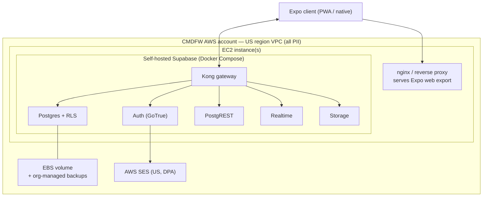

# AWS Hosting Path — Org-Owned EC2 (Future Alternative)

**Date:** 2026-06-16
**Status:** **Future / alternative topology — NOT the POC deployment.** The POC ships on the managed stack in [3_ARCHITECTURE.md](3_ARCHITECTURE.md) §7 (Netlify static host + managed Supabase, US region, ~$0). This document records the *whole-stack* org-owned AWS path so the option is well-understood and ready to evaluate when the org chooses to own its infrastructure. Adopting it is a deliberate future decision, not a POC step.

> **Why a separate doc:** this path trades the POC's two defining wins — volunteer-friendly ops (doc 1 G3) and near-$0 cost (G4) — for full org ownership and control. Keeping it out of the main architecture doc avoids implying it's part of the pilot, while keeping it documented and cross-referenced from §7.

---

## 1. What this path is

CMDFW runs the **entire stack on its own AWS account** — the web app **and** the backend — on EC2, in a US region:

- **Web app:** the Expo **web export** (static build) served by nginx (or S3 + CloudFront), on/in front of an org-owned EC2 instance.
- **Backend:** **self-hosted Supabase via Docker Compose** (the official self-host method — verified live on Supabase's self-hosting docs, 2026-06-17): Postgres, Auth (GoTrue), PostgREST, Realtime, Storage, Kong gateway, Studio.
- **Email:** AWS SES (unchanged from the managed path) or a self-managed SMTP relay.
- **Everything inside a US-region VPC** the org controls.

**Key property: no application rewrite.** The Expo client and the SQL migrations/RLS/auth-hook are identical to the managed path — only the Supabase URL/keys and the host change. Migrating is a *deployment* change, not a *code* change. This is what makes the path viable as a clean future cutover rather than a re-platform.

---

## 2. What the org gains

- **Full data ownership & control** — the database, backups, and every byte of minors' data live on infrastructure CMDFW owns and administers. The strongest possible answer to data-residency and data-control questions.
- **Residency is trivially satisfied** — pick a US region for the VPC; nothing leaves it.
- **No managed-vendor dependency** for the core data plane (SES/Sentry can stay or be replaced).
- **Cost is fixed and predictable** at scale (a flat instance bill) rather than usage-tiered.

---

## 3. What the org takes on (verified from Supabase self-hosting docs, 2026-06-17)

Self-hosting moves these from "managed by Supabase" to **"owned by CMDFW's maintainers"**:

- Server provisioning and maintenance
- **Security hardening and keeping the OS + all services patched**
- Postgres database maintenance
- **High availability and scalability**
- **Backups and disaster recovery** (you build and test these)
- **Monitoring and uptime**

And these managed-platform features are **unavailable** when self-hosted:

- **Managed backups and Point-in-Time Recovery (PITR)** — must be self-implemented
- Branching, advanced platform metrics (beyond logs), ETL, analytics buckets, the platform management API
- A self-hosted instance **mimics a single project** — no multi-project/multi-org in Studio

Support is **community-only** (no SLA).

---

## 4. Cost model (illustrative — verify at adoption time)

| Item | Managed POC path (§7) | Org-owned EC2 path |
|---|---|---|
| Compute | $0 (Netlify Free + Supabase Free) | EC2 small instance ~$8–15/mo (t3/t4g.small), larger at scale |
| Storage | included | EBS ~$0.08/GB-mo (gp3) + snapshot storage |
| Data transfer | included | metered egress |
| Backups / PITR | **managed, included** | **self-built** (snapshots, WAL archiving) — effort + storage |
| Ops labor | ~none | **ongoing** (patching, monitoring, DR drills) |

EC2 on-demand is per-hour with **no long-term free tier** (the 12-month AWS Free Tier is limited and expires) — so this path is **not $0**, and its largest real cost is **maintainer time**, not the instance bill.

---

## 5. When to consider adopting this path

Trigger conditions (any of):

1. The org has **dedicated technical ops capacity** (not just the 3 non-technical volunteers) able to own backups/DR/patching/monitoring.
2. A **compliance or board requirement** mandates full first-party data ownership beyond a signed DPA.
3. **Post-pilot scale** where managed-tier costs and a desire for fixed, predictable billing justify the ops investment.
4. The org explicitly accepts the loss of managed backups/PITR and commits to a **tested** self-managed backup + recovery process *before* any minors' data lands on it.

If none hold, the managed POC stack (§7) remains the correct choice.

---

## 6. Migration sketch (managed → org-owned), when the trigger fires

1. **Stand up** the EC2 instance + VPC in a US region; harden the OS; install Docker + Docker Compose.
2. **Deploy** self-hosted Supabase via the official Compose file; configure via environment variables; put it behind nginx/Kong with TLS.
3. **Apply** the same `supabase/migrations/` (schema + RLS + auth hook) — identical SQL, so RLS behavior is unchanged.
4. **Build & implement** the backup + PITR strategy (automated snapshots + WAL archiving to S3) and **test a restore** before cutover.
5. **Migrate data** with `pg_dump`/`pg_restore` from the managed project.
6. **Build & serve** the Expo web export from nginx (or S3 + CloudFront).
7. **Repoint** the client/functions env vars (Supabase URL + keys) per environment; **no app-code changes**.
8. **DNS cutover** after validation; keep the managed project as fallback until the self-hosted stack is proven.
9. **Stand up** monitoring/alerting and an on-call/runbook owner.

---

## 7. Hard preconditions before any minors' data is hosted this way

- A **tested** automated backup + disaster-recovery process (PITR-equivalent) is live.
- OS/service **patching cadence** and **monitoring/alerting** are operational with a named owner.
- Security hardening reviewed (network ACLs, secrets management, least-privilege, TLS everywhere).
- The same **consent / audit / retention** controls (doc 1 §10) and **adversarial RLS tests** (3_ARCHITECTURE §5/§12) pass on the self-hosted instance.

---

*This document is a forward-looking option only. Until the org explicitly decides to adopt it, the authoritative deployment is the managed stack in [3_ARCHITECTURE.md](3_ARCHITECTURE.md) §7.*
