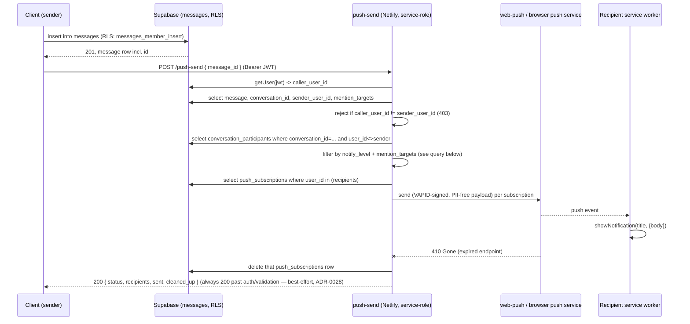

# System — notifications infra

> **owner:** System · **consumers:** all 6 human personas as recipients (Student, Parent, Teacher primary per issue #5; Coordinator/BV Coordinator/Admin also receive as `conversation_participants` in `session_staff`/`leadership` threads, per ADR-0016's role-aware defaults) · **scope:** Web Push (VAPID) delivery infra + AWS SES as Supabase Auth's SMTP provider (magic-link only) — plugs into `push_subscriptions` and `conversation_participants.notify_level` · **governing ADR:** ADR-0016 (notification-preferences, consumed — this item implements its dispatch rule), ADR-0015 (chat-access-model, consumed — mention syntax/no-DM boundary), ADR-0003 (access-control-rls, consumed), **ADR-0028 (push dispatch is client-invoked, new)** · **covers:** doc 3 §8 (notifications), doc 1 §9 (thinnest-slice push), doc 2 §2/§4/§5 (notifications/alerts per persona)

**Stage:** `/refine` ✓ → `/architect` ✓ (ADR-0028; revisited 2026-07-24 during `#21`'s `/architect` pass — ADR-0031 amends the `push-send` contract below) → `/design` ✓ → `/plan` ✓ (`docs/superpowers/plans/2026-07-21-notifications-infra.md` — **needs a re-sync pass for ADR-0031 before `/build`**) → `/migration` is a no-op (no new tables/columns/RLS — confirmed in Design's "Data & RLS impact") → next is `/build`.

---

## Requirements (refined)

### User story
As a Student, Parent, or Teacher (and any other persona who is a chat participant), I want to receive a Web Push notification when something relevant happens in a conversation I'm part of — respecting my notification level and whether I was actually mentioned — so that I don't have to keep the app open to know when someone needs my attention, without being spammed by every message in every thread I sit in.

### Roadmap context (why this item is scoped the way it is)
Read across the open backlog rather than in isolation (per human direction during refine):
- **`core-schema-and-rls`** (Built) already shipped `push_subscriptions` (owner-only RLS) and the chat durability tables (`conversations`, `conversation_participants` incl. `notify_level`/`notification_default`, `messages` incl. mention-target columns) — all real, queryable today.
- **#6 `realtime-chat-delivery`** (Not started) is a *different* concern: live in-app Realtime Broadcast delivery while a client is connected. This item (push) is for when the recipient's app is **not** open/connected — the two are complementary, not sequenced against each other.
- **#21 `class-update-and-home-feed`** (Not started, owned by Teacher) is the eventual second trigger source (posting a class update). Its own storage model (there is no `class_updates`/`announcements` table yet — doc 3 §6.2 only lists the chat/push tables) is that item's decision to make, not this one's. This item must not invent that table.
- **#24 `class-chat-ui`** (Not started) is blocked on both `client-auth-session-and-nav` (#17, done) and `realtime-chat-delivery` (#6) — meaning no client can send a chat message yet either. This item builds and proves the dispatch logic against the existing `messages`/`conversation_participants` schema (seeded/inserted directly for test purposes), ahead of any UI existing to send a real message.

**Conclusion carried into this brief:** build the push-send capability as a **general delivery function** (given target user(s) + a PII-free payload, deliver via Web Push), with **chat messages as the first concrete, schema-backed trigger** (the only table today carrying `notify_level`) — not a chat-only, single-purpose function. #21 becomes a second caller later without rework here.

### Decisions captured during refine
- **Email scope, resolved:** magic-link sign-in already goes out via Supabase Auth's built-in `signInWithOtp` (built in `client-auth-session-and-nav`, #17) — not a custom function. This item's "SES email delivery" is **infra/config only**: point Supabase Auth's outbound SMTP at AWS SES (US region, DPA) so magic-link email is deliverable — domain verification, DKIM/SPF, and the one-time sandbox-exit request. **No custom per-event notification email and no push-failure email fallback at POC** — Web Push is the only per-event channel. (Confirmed by human during refine.)
- **Trigger scope, resolved:** dispatch is keyed off `conversation_participants.notify_level` (ADR-0016) against real chat messages — this is what issue #5's own scope line names explicitly, and it's the only trigger buildable against schema that exists today. A generic class-update/announcement trigger is *not* built here (no such table exists yet); the delivery function is shaped so #21 can call it once its table lands, but that integration itself is out of scope for this item.
- **Recipients include oversight roles.** ADR-0016 explicitly sets role-aware defaults for Admin/BV Coordinator/Coordinator ("Mentions only") — those roles must be real push recipients (at their default, quieter level) for that ADR to mean anything, even though issue #5's consumer line names Student/Parent/Teacher as the primary/typical case.
- **Invocation mechanism: resolved by `/architect` — client-invoked (ADR-0028).** After the client's RLS-permitted `messages` insert succeeds, the client calls `push-send` (bearer JWT) with the `message_id`; the function re-derives recipients/`notify_level`/mentions server-side rather than trusting the client. No DB trigger, no `pg_net`, no new secret-handling surface. Accepted trade-off: best-effort — if the client never gets to make that follow-up call, that one push silently doesn't fire (the message itself is unaffected). See ADR-0028 for the full options analysis.

### Acceptance criteria
1. **Push subscription capture.** The PWA registers a service worker and subscribes to Web Push using a VAPID public key (not secret — safe to ship in client config); the resulting `endpoint` + `p256dh`/`auth` keys are written to the existing `push_subscriptions` table (owner-only RLS, already built). A user may hold multiple subscription rows (multiple devices/browsers).
2. **"Add to Home Screen" onboarding.** Because Web Push on iOS only fires for a PWA added to the Home Screen (iOS 16.4+) — not a plain Safari tab (doc 3 §8.1, the highest-risk POC item) — the subscribe flow surfaces this requirement to the user before/around the permission prompt, rather than silently failing on iOS Safari.
3. **`push-send` delivery function.** A US-region Netlify function holds the VAPID **private** key (never in client code or Git — constitution rule #2) and, given a set of target `user_id`s plus a PII-free payload (e.g. "New message in <conversation label>" — no sender name, no message body), reads their `push_subscriptions` rows and dispatches via `web-push`.
4. **Chat dispatch respects `notify_level`.** On a new row in `messages`, for every `conversation_participants` row on that conversation **except the sender**: `muted` → never notified; `mentions` → notified only if targeted by the message's mention columns (`@individual` at them, or `@Students`/`@Parents` matching their role); `all` → always notified. Role-aware seeded defaults (ADR-0016, already applied at membership-creation time by `core-schema-and-rls`) are read, not re-derived, here.
5. **No open-DM leak via push.** Push dispatch must not create a notification path that reveals a message to a non-participant — it reads `conversation_participants` for the conversation being pushed about, the same boundary RLS already enforces on direct reads (ADR-0015's no-student-DM guarantee must hold for push too, not just for reads).
6. **Expired-subscription cleanup.** A `410 Gone` (or equivalent permanently-invalid) response from the push service deletes that `push_subscriptions` row so dead endpoints don't accumulate or get retried forever.
7. **Silent no-op, not an error, when unreachable.** A recipient with zero push subscriptions (never subscribed, denied permission, or iOS-not-installed) is simply skipped — no email fallback (per the decision above), no user-facing error.
8. **SES as Supabase Auth's SMTP (infra/config).** Supabase Auth's outbound email is configured to send through AWS SES (US region, DPA) rather than Supabase's default sender, for magic-link deliverability at real send volume — domain verification + DKIM/SPF + the one-time SES sandbox-exit request. No new application code path; this is provider configuration for the auth flow #17 already built.
9. **Payload PII-free, everywhere.** No push payload (title, body, tag/data) ever carries a person's name, message content, or other PII — generic copy only (privacy-rules).

### Edge cases
- **Self-notification.** The message sender never receives a push for their own message.
- **Multi-device fan-out.** A user with 2+ `push_subscriptions` rows gets pushed on all of them; one device's expired subscription being cleaned up (AC#6) must not affect delivery to the user's other devices in the same dispatch.
- **Membership changes mid-conversation.** `conversation_participants` is trigger-maintained (grade change, roster change) by `core-schema-and-rls` — dispatch reads current participants at send time, so a removed member never gets pushed and a newly-added member is included, with no separate logic needed here.
- **`muted` still allows the app's own in-app view.** Muting is push-only; it must not be confused with hiding the conversation itself (that's a client/UI concern, out of scope here).
- **Mixed mention targeting.** A message mentioning `@Students` should notify only participants whose `participant_role` resolves to student-side, not the whole roster, even at `mentions` level.
- **VAPID key rotation.** Not designed for at POC (single static keypair) — flag as a known gap, not solved speculatively here.
- **Missed push on client failure (ADR-0028, accepted).** If the client crashes/loses network after the `messages` insert commits but before it calls `push-send`, that one push never fires. The message is unaffected — every participant still sees it via RLS-scoped read/poll; only the out-of-app notification is missed. Disclosed, not silently absorbed.

---

### Consumers
Student, Parent, Teacher as the named/primary recipients (issue #5); Coordinator, BV Coordinator, Admin as participants of `session_staff`/`leadership` conversations at their ADR-0016 default. `#21 class-update-and-home-feed` is a future second caller of the generic `push-send` capability once its own trigger table exists (not built here).

### Access scope (§5.4)
No new RLS surface — `push_subscriptions` (owner-only) and `conversation_participants`/`messages` (participant-scoped) RLS already exist and are unchanged by this item. The `push-send` function runs service-role, server-side only; VAPID private key and SES credentials live only in `netlify/functions/` env (constitution rule #2).

### Explicitly out of scope (so a later item picks it up)
- The `class_updates`/announcements table itself, and #21's own recipient/RLS logic beyond the `push-send` contract — owned by `#21 class-update-and-home-feed` (Teacher persona). This item's `push-send` contract (amended by ADR-0031) is the only piece shared across the two; #21 does not require rework of the function's core dispatch/cleanup/response phases.
- Realtime in-app (WebSocket) delivery while a client is connected — `#6 realtime-chat-delivery`.
- Any custom per-event notification email or push-failure email fallback — explicitly decided out at POC (see Decisions above).
- Exact invocation mechanism (client-call-after-insert vs. DB trigger/webhook) — a `/design`-stage decision, not fixed here.
- VAPID key rotation/multi-key support.

---

## Architect review — sign-off (2026-07-21)

**Outcome: signed off, 1 ADR recorded.** The brief is sound against the architecture — no new RLS surface (owner-scoped `push_subscriptions`, participant-scoped `conversation_participants`/`messages` are unchanged), no new external processor (VAPID/`web-push` and SES were both already architecturally decided — doc 3 §6/§8), US residency and minors'-data minimization are unaffected (payloads stay PII-free, no new PII column anywhere). One genuinely new decision was surfaced and recorded rather than left implicit:

1. **ADR-0028 — push dispatch is client-invoked, not a DB trigger/`pg_net`.** The refine brief correctly flagged this as open rather than guessing. Decision: the client calls `push-send` as a follow-up step after its own `messages` insert succeeds; the function re-derives recipients/`notify_level`/mentions server-side (never trusts the client for *who* gets notified). Chosen over a `pg_net` DB-trigger for zero new extension/secret-handling surface, matching this repo's only existing pattern (`csv-import`, `user-role-grant`, `user-role-sweep` are all client-invoked). Accepted trade-off: best-effort delivery — a client that never makes the follow-up call means that one push silently doesn't fire, though the underlying message is never lost.

**Not ADR-worthy (scope-narrowing/execution detail, no new decision):**
- **"SES as Auth-SMTP-only, no per-event notification email fallback."** This narrows doc 3 §8.2's original framing (which loosely bundled "notification fallbacks" into the email function) but doesn't introduce a new external processor, schema shape, or access pattern — SES was already the architecturally-decided email processor (doc 3 §3/§6), and magic-link email already ships via Supabase Auth's own `signInWithOtp` (`client-auth-session-and-nav`, #17), not a custom function. Confirmed as the human's explicit refine-time decision; no new record needed, same category as `core-schema-and-rls`'s "auth-hook exclusion" precedent.
- **Generic (not chat-only) shape of `push-send`.** A scoping/implementation-economy choice so `#21 class-update-and-home-feed` can call the same function later — doesn't change access control, residency, or minors'-data posture, so it rides on ADR-0028's consequences rather than needing its own record.

**Confirmed:** owner (System), consumers (Student/Parent/Teacher primary + Coordinator/BV Coordinator/Admin as participant-scoped recipients), and scope (Web Push delivery + SES-as-Auth-SMTP) are sound per §12.12.

**Hand-off → `/design`:** produce the exact `push-send` function signature/request shape, the client-side subscribe flow (service worker registration + "Add to Home Screen" onboarding UI), the `notify_level`/mention-matching query against `conversation_participants`/`messages`, and the SES-as-Auth-SMTP configuration steps (domain verification, DKIM/SPF, sandbox-exit request).

---

## Design (2026-07-21)

### Behavior — dispatch sequence



The client call is **fire-and-forget**: the chat send UX resolves on the `messages` insert alone and does not await, block on, or surface errors from the `push-send` call — consistent with ADR-0028's accepted best-effort gap (edge case: "Missed push on client failure"). A failed or slow `push-send` never blocks or shows an error on the message the sender just sent.

### `push-send` contract

`POST /.netlify/functions/push-send`, `Authorization: Bearer <user JWT>` (same auth pattern as `user-role-grant`/`csv-import`).

**Request body (amended 2026-07-24, ADR-0031):** a discriminated union — `{ "message_id": "<uuid>" }` **or** `{ "class_update_id": "<uuid>" }`, never both, never neither (422 otherwise). `class_update_id` is `class-update-and-home-feed` (#21)'s reference, added as this item's second caller per ADR-0028's own anticipation; ADR-0031 is the record of the concrete contract shape. The function is deliberately "thin caller, fat function" (ADR-0028): it re-derives everything else from the DB, for either branch.

Phases (matching the existing `user-role-grant.ts` phased style); phases 1, 2, 6, 7 are shared, phases 3–5 branch on which reference was sent:
1. **Auth.** `client.auth.getUser(token)` → `caller_user_id`. 401 if missing/invalid.
2. **Validate.** Exactly one of `message_id` / `class_update_id` present + UUID-shaped. 422 otherwise.
3. **Load + authorize.**
   - `message_id` branch: service-role select of `messages` (id, conversation_id, sender_user_id, mention_targets). Not found → `200 {status:'noop'}`. If `sender_user_id !== caller_user_id` → `403`. (Flagged during design, confirmed at sign-off: because `push-send` runs service-role and bypasses RLS entirely, nothing else stops an authenticated-but-unrelated caller from repeatedly triggering dispatch about a message they didn't send — a notification-spam vector against that message's real recipients.)
   - `class_update_id` branch (ADR-0031): service-role select of `class_updates` (id, class_id, posted_by). Not found → `200 {status:'noop'}`. If `posted_by !== caller_user_id` → `403` (same spam-vector rationale as the message branch).
4. **Derive recipients.**
   - `message_id` branch: service-role select of `conversation_participants` for the message's `conversation_id`, excluding the sender. Filter per participant (see query below).
   - `class_update_id` branch (ADR-0031): service-role select of current `enrollments` for `class_id` → the enrolled Students + their Parents, excluding the poster.
5. **Payload copy** (PII-free, both branches — never scope_id, never message/update body, never names):
   - `message_id` branch: keyed off `conversations.kind` — `class` → "New message in your class chat", `session_staff` → "New message in your session staff chat", `leadership` → "New message in the leadership chat".
   - `class_update_id` branch (ADR-0031): generic — "New update posted in your class" (exact copy is `class-update-and-home-feed`'s `/design` decision, following this ADR's shape).
6. **Fan out.** Service-role select of `push_subscriptions` for the recipient `user_id`s; `web-push` dispatch per subscription with the phase-5 payload.
7. **Cleanup.** Any subscription whose send fails with `statusCode` 404/410 (permanently gone) is deleted from `push_subscriptions`. Other failures (e.g. transient 5xx) are logged and skipped — no retry queue at POC.
8. **Response.** Always `200 { status: 'dispatched', recipients: N, sent: N, cleaned_up: N }` once past phases 1–3 — matches AC#7 (silent no-op, not an error).

### `notify_level` / mention-matching filter

Implemented as a single service-role `select` of `conversation_participants` scoped to the conversation, then filtered in TypeScript (matching this repo's existing convention of putting business logic in the function, not a new plpgsql RPC — see `user-role-grant.ts`'s `isGrantAllowed`/tiering logic) — the per-conversation row count is small enough that a DB-side function buys nothing:

```ts
const isRecipient = (cp: ConversationParticipant, mentionTargets: string[]) => {
  if (cp.user_id === senderUserId) return false;
  if (cp.notify_level === 'all') return true;
  if (cp.notify_level === 'muted') return false;
  // notify_level === 'mentions'
  return (
    (mentionTargets.includes('students') && cp.participant_role === 'student') ||
    (mentionTargets.includes('parents') && cp.participant_role === 'parent') ||
    mentionTargets.includes(`individual:${cp.user_id}`)
  );
};
```

`mention_targets` values (`parents` / `students` / `individual:<user_id>`) are as already fixed by `core-schema-and-rls`'s `messages` schema — not a new decision here.

### Client-side subscribe flow

This repo has **no PWA infrastructure yet** (`app.json` has no service worker / manifest config, `repository-bootstrap` never added one) — this item introduces the minimum needed, not a full offline-caching PWA:
1. New `public/manifest.webmanifest` (name, icons, `"display": "standalone"`, `start_url`) + a `<link rel="manifest">` in the web head — Expo's static web export serves `public/` verbatim.
2. New `public/sw.js` — a minimal hand-written service worker (no Workbox, no offline caching — out of scope): a `push` listener calling `self.registration.showNotification(title, { body })`, and a `notificationclick` listener that focuses/opens the app. Kept intentionally minimal.
3. VAPID **public** key ships to the client as `EXPO_PUBLIC_VAPID_PUBLIC_KEY` (not secret — safe in client bundle, same pattern as `EXPO_PUBLIC_SUPABASE_URL`/`EXPO_PUBLIC_SUPABASE_ANON_KEY`).
4. Flow: show `PushPermissionPrompt` (design ref below) near first meaningful action after sign-in → on "Enable notifications": `navigator.serviceWorker.register('/sw.js')` → `registration.pushManager.subscribe({ userVisibleOnly: true, applicationServerKey: <decoded VAPID public key> })` → upsert `{ user_id, endpoint, p256dh_key, auth_key }` into `push_subscriptions` directly via the client's own anon-key session (owner RLS already permits this — AC#1).
5. If `window.matchMedia('(display-mode: standalone)').matches` is false on an iOS UA, show the "Add to Home Screen" install hint (see UI below) instead of / ahead of the enable button — iOS Web Push only fires for an installed PWA (doc 3 §8.1, highest-risk POC item).

### SES-as-Auth-SMTP configuration (infra/config only — no application code)
1. Verify the sending domain in SES (US-East) and add the SPF/DKIM DNS records at the domain registrar.
2. Create an IAM SMTP user scoped to `ses:SendRawEmail` only; generate SMTP credentials.
3. Supabase Dashboard → Auth → SMTP Settings: enable custom SMTP, host `email-smtp.us-east-1.amazonaws.com`, port 587, the SMTP credentials from step 2, sender = the verified domain address.
4. Submit the one-time SES sandbox-exit request (production sending access).
5. Send a real magic-link and confirm delivery with DKIM=pass/SPF=pass in the received headers.
No new Netlify function, no new secret beyond the SMTP credentials (which live in the SES/Supabase dashboards, not in this repo). This is a runbook for `/plan`/`/deploy-staging`, not code to write here.

### UI

Design reference (pulled from the **Chinmaya Mission Design System** project; confirmed the local mirror at `design/sankalp/bv-connect/components/notifications/` is byte-for-byte in sync with the canonical source as of 2026-07-21 — no refresh needed):
- **`PushPermissionPrompt.jsx`** (+ `.prompt.md`) — the soft-ask card ("Enable notifications" / "Not now"), shown once near first meaningful action per its own prompt doc.
- **"Add to Home Screen" install hint** — no dedicated component exists for this in either the local mirror or the canonical design-system project (checked both). Rather than requesting a new bespoke asset for a single onboarding string, compose it from existing primitives — `components/core/Card.jsx` + `components/core/Button.jsx` — with short, generic copy (e.g. "Add Bala Vihar Connect to your Home Screen to get notifications on iPhone"). Flagging this composition choice for sign-off since it's a judgment call rather than a pulled reference.
- **`NotificationItem.jsx`** exists in the same design-mirror folder but is the row component for a future **in-app notification center** screen — not built by this item (no such screen is in scope here); noted only so a later item (`#21` or a dedicated notifications-center item) reuses it instead of reinventing it.

Design DoD applied: tokens only (no hex/spacing literals — both reference components already compose from `var(--...)` tokens), one primary action (`Enable notifications`) vs. one secondary (`Not now`), ≥44px touch targets (both buttons already sized `9px 16px` padding at 13px text — verify ≥44px effective hit area at build time), no loading/error/permission-denied states needed (this is a static, non-role-gated ask, not a data screen).

### Data & RLS impact

No new tables, columns, or RLS policies — confirmed unchanged from the Requirements section above. `push-send` runs service-role (bypasses RLS by design, per ADR-0028) and is the only place that reads across the recipient set; it must never accept a client-supplied recipient list or payload (ADR-0028) and must reject a caller who isn't the referenced row's own author, for either branch (phase 3 above; ADR-0031 extends this to `class_updates.posted_by`).

### Edge cases (added during design, beyond the refine-stage list above)
- **Caller ≠ sender on `push-send`.** A `message_id` whose `sender_user_id` doesn't match the caller's JWT is rejected (403), not silently processed — closes the notification-spam vector described in phase 3.
- **Payload copy is keyed off `conversations.kind` only**, never `scope_id` or any table join that could leak which specific class/session/child is involved — "your class chat" not "Ms. Smith's Grade 3 chat".
- **First PWA infra in this repo.** `public/manifest.webmanifest` and `public/sw.js` are net-new — no prior item shipped either, so `/plan` should account for them as new files, not modifications.

### Out of scope (carried forward + additions)
- In-app notification center screen (home of `NotificationItem.jsx`) — future item, not this one.
- `email-send` as a custom function — confirmed at `/architect`: SES is Auth-SMTP-only at POC, no custom notification-email function exists or is added here (despite `functions-secrets.md` listing "five jobs at POC" including `email-send` — that rule file is aspirational/pre-existing text, not a requirement this item must fulfill; the refine+architect decision explicitly narrows it, see "Decisions captured during refine" above).
- Web Push retry/backoff beyond what the `web-push` library does natively; no retry queue.
- VAPID key rotation/multi-key support (carried from refine).
- Native push (APNs/FCM) — post-POC fast-follow (doc 3 §8.3).

**Hand-off → `/plan`:** implement `netlify/functions/push-send.ts` (+ `lib/` helpers for the recipient-filter and payload-copy logic, matching `user-role-grant.ts`'s phased style), add the `web-push` dependency, add `public/manifest.webmanifest` + `public/sw.js` + client subscribe flow (`lib/notifications/` or similar), wire `PushPermissionPrompt`/install-hint into the nav shell post-sign-in, and produce the SES-as-Auth-SMTP runbook as a deploy-staging step. pgTAP/adversarial coverage for phase-3's caller≠sender check and the mention-matching filter is a `/test`-stage obligation per constitution rule #4.

---

## Design sign-off (2026-07-21)

**Approved as written**, including the one flagged item: `push-send` phase 3 must reject any caller whose `caller_user_id` doesn't match the message's `sender_user_id` (403) — confirmed by the human, not just proposed. Carried into `/plan` as a required check, not an optional hardening.
