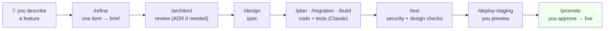
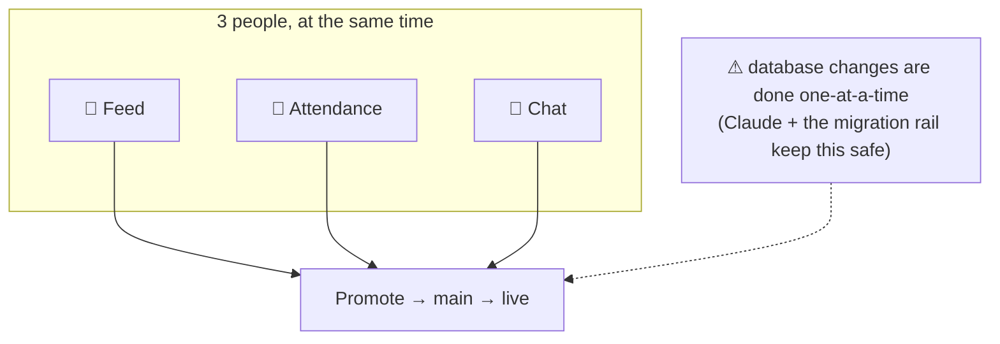

# CMDFW Bala Vihar — Connect (POC)

Community + operations app for a weekly children's program. Built by a small team **+ Claude Code**.

> **Claude builds; humans decide.** Every change flows through stages, and automatic safety rails block mistakes.
> Deep docs: [.docs/3_ARCHITECTURE.md](.docs/3_ARCHITECTURE.md) · rules Claude follows: [.claude/CLAUDE.md](.claude/CLAUDE.md) · decisions: [.docs/adr/](.docs/adr/)

Expo (RN + RN-Web) · Supabase (Postgres/RLS) · Netlify (PWA + US-region functions).
Governance & architecture live in `.docs/` and `.claude/`.

---

## How we work


<sub>Every item flows **refine → architect review → design**, in order (architect records an ADR only when a decision is significant). You **type the slash command**; Claude runs the tools.</sub>

| Stage | You type | What happens |
|---|---|---|
| Design | `/refine` → `/architect` → `/design` | one item refined, reviewed (ADR if needed), then specced |
| Development | `/plan` `/migration` `/build` | Claude writes the database + code, **tests first** |
| Testing | `/test` | runs tests + **security (RLS)** + **design** checks |
| Promotion | `/deploy-staging` → `/promote` | preview, then you approve to go live |

---

## Get set up (install once)

| Install | Why |
|---|---|
| **Claude Code** | the assistant that does the work |
| **Git** + a GitHub account | code + history |
| **Node.js 22+** | app runtime |
| **Docker Desktop** | runs the local database |
| **Supabase CLI** | local database + migrations |
| **Open Design** | design system + screen prototypes |

> You install these **once**. You don't memorize commands — **Claude runs them**. Ask it: *"set up my local environment."*

---

## First-time setup

1. `nvm use`           — Node 22 (see `.nvmrc`)
2. `npm install`
3. `npm run env:init`  — creates `.env` from `.env.example`
4. `npm run doctor`    — checks your machine; fix any ✗
5. `npm run dev`       — whole local loop (needs Docker Desktop running)

Copy the **anon** and **service_role** keys printed by the first `npm run db:start` into `.env`.
**Never commit `.env`.** Secrets (service-role key, VAPID private key, SES creds) belong only in
`netlify/functions/` and Netlify env — never with the `EXPO_PUBLIC_` prefix.

---

## Daily commands

| Command | Does |
|---|---|
| `npm run dev` | DB + functions + app (one URL: http://localhost:8888) |
| `npm run start` | app only (no DB/Docker needed) |
| `npm run stop` | stop the local DB |
| `npm run db:reset` | re-apply migrations + seed |
| `npm run doctor` | prerequisite check |
| `npm run typecheck` | TypeScript type-check |
| `npm run lint` | ESLint |

**Teardown:** `Ctrl-C` stops the app/functions but **not** the detached DB — run `npm run stop` when you're done.

**Port conflicts:** override ports via env if 54321 / 8081 / 8888 are taken (see `supabase/config.toml` and `netlify.toml`).

---

## A typical task

```text
You:    "Add the teacher attendance screen."
Claude: proposes a plan, asks a couple of questions  ← you decide
You:    /refine → /architect → /design → /plan → /build → /test
Claude: writes the spec, the database rules, the screen, and the tests
You:    /deploy-staging   → look at it on the staging link
You:    /promote          → approve → live
```

Safety rails run automatically — Claude **cannot** commit secrets, leak a child's data, or push an untested database change.

---

## Working in parallel (3 maintainers + Claude)

Each person takes one **Unit of Work** (one persona × functionality) on its own branch or worktree. Work happens side-by-side; everything merges at **Promote**.



| Person | Owns (example) |
|---|---|
| A | Teacher + Coordinator features |
| B | Student + Parent features |
| C | Design system + shared/System pieces |

**Conventions for parallel work:**

- **Unit of Work:** one feature = one `(persona, functionality)` pair → its own branch/worktree.
- **Schema is the serialized seam:** migrations in `supabase/migrations/` apply in timestamp order. Coordinate schema changes; convergence is a PR to `main`.
- **Lockfile conflicts:** never hand-edit `package-lock.json`. Resolve by taking the merged `package.json`, then run `rm package-lock.json && npm install` and commit the regenerated lock.
- **Pipeline per item:** `/refine` → `/architect` → `/design` → `/plan` → `/migration` → `/build` → `/test` → `/deploy-staging` → `/promote`.

---

## Status

Greenfield. The **architecture + ways-of-working are set**; the app code and the Sankalp design import come next (see [.docs/3_ARCHITECTURE.md §12.13](.docs/3_ARCHITECTURE.md)). Start any work by describing it to Claude Code.
