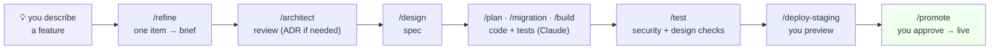
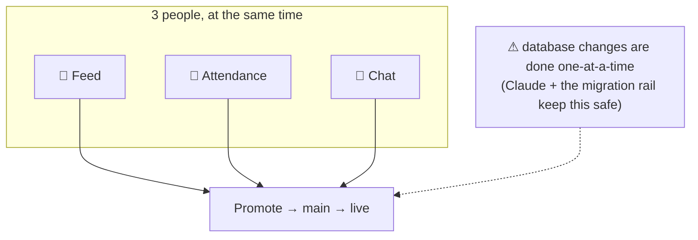

# CMDFW Bala Vihar — Connect (POC)

Community + operations app for a weekly children's program. Built by a small team **+ Claude Code**.

> **Claude builds; humans decide.** Every change flows through stages, and automatic safety rails block mistakes.
> Deep docs: [.docs/3_ARCHITECTURE.md](.docs/3_ARCHITECTURE.md) · rules Claude follows: [.claude/CLAUDE.md](.claude/CLAUDE.md) · decisions: [.docs/adr/](.docs/adr/)

---

## How we work


<sub>Every item flows **refine → architect review → design**, in order (architect records an ADR only when a decision is significant). You **type the slash command**; Claude runs the tools.</sub>

| Stage | You type | What happens |
|---|---|---|
| Design | `/refine` → `/architect` → `/design` | one item refined, reviewed (ADR if needed), then specced |
| Development | `/plan` `/migration` `/build` | Claude writes the database + code, **tests first** |
| Testing | `/test` | runs tests + **security (RLS)** + **design** checks |
| Promotion | `/deploy-staging` → `/promote` | preview, then you approve to go live |

---

## Get set up (install once)

| Install | Why |
|---|---|
| **Claude Code** | the assistant that does the work |
| **Git** + a GitHub account | code + history |
| **Node.js 22+** | app runtime |
| **Docker Desktop** | runs the local database |
| **Supabase CLI** | local database + migrations |
| **Open Design** | design system + screen prototypes |

> You install these **once**. You don't memorize commands — **Claude runs them**. Ask it: *"set up my local environment."*

---

## A typical task

```text
You:    "Add the teacher attendance screen."
Claude: proposes a plan, asks a couple of questions  ← you decide
You:    /refine → /architect → /design → /plan → /build → /test
Claude: writes the spec, the database rules, the screen, and the tests
You:    /deploy-staging   → look at it on the staging link
You:    /promote          → approve → live
```

Safety rails run automatically — Claude **cannot** commit secrets, leak a child's data, or push an untested database change.

---

## Working in parallel

Each person takes one **feature** on their own copy (branch). Work happens side-by-side; everything merges at **Promote**.



| Person | Owns (example) |
|---|---|
| A | Teacher + Coordinator features |
| B | Student + Parent features |
| C | Design system + shared/System pieces |

---

## Status

Greenfield. The **architecture + ways-of-working are set**; the app code and the Sankalp design import come next (see [.docs/3_ARCHITECTURE.md §12.13](.docs/3_ARCHITECTURE.md)). Start any work by describing it to Claude Code.
